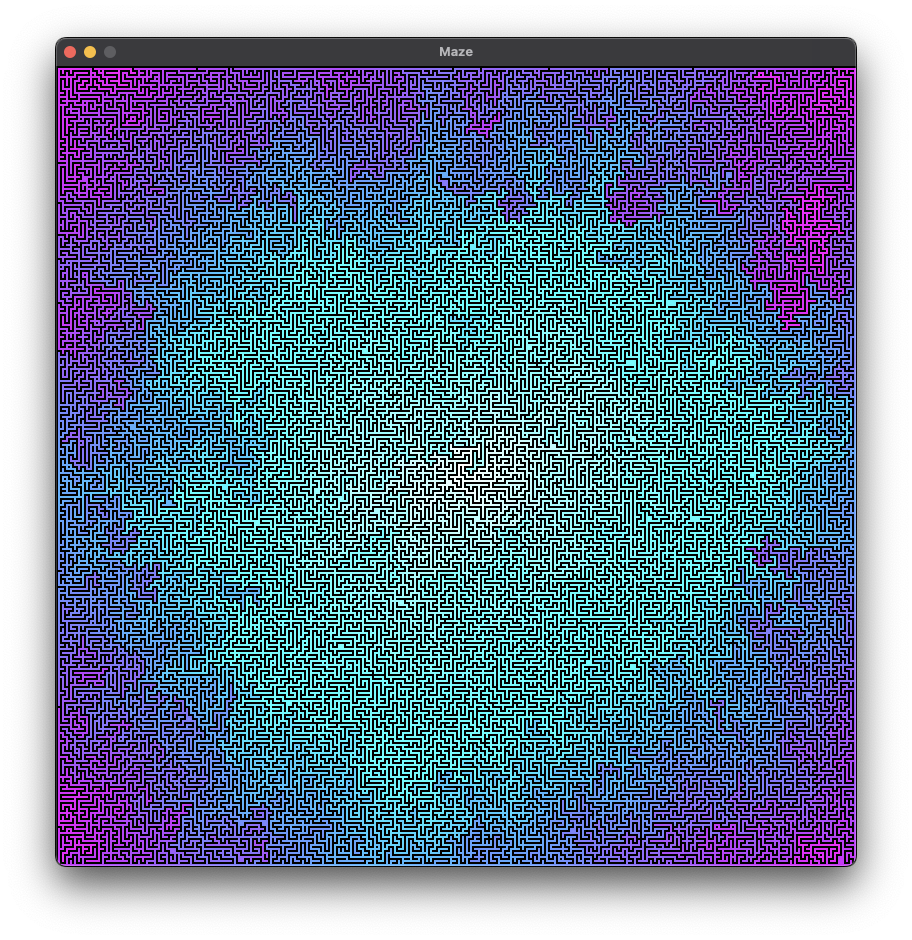

# Maze

## Dependencies

+ https://github.com/AnotherJohnH/Platform  (pulled in at checkout)
+ SDL2
+ cmake via UNIX make or auto detection of ninja if installed
+ Python3

## Checkout

This repo uses git sub-modules, so checkout using --recurse to clone all the
dependent source...

    git clone --recurse https://github.com/TheNoodlers/Maze.git

or

    git clone --recurse ssh://git@github.com/TheNoodlers/Maze.git

## Build

Developed on MacOS but should build on Linux too. Indirect build with
`cmake` and `make` or `ninja`...

    make

Direct build using `cmake` and `make`...

    mkdir build
    cd build
    cmake ..
    make

## Run

After a build binary will be found here `buid/native/maze`. Command line interface...

    NAME
         Maze - Maze generator

    SYNOPSIS
         maze [options] 

    OPTIONS
         -v,--version             Display version information
         -h,--help                Display this help
         -W,--width <unsigned>    Width [400]
         -H,--height <unsigned>   Height [400]
         -s,--scale <unsigned>    Scale [2]
         -c,--complexity <float>  Complexity [0.75]
         -d,--density <float>     Density [0.75]
